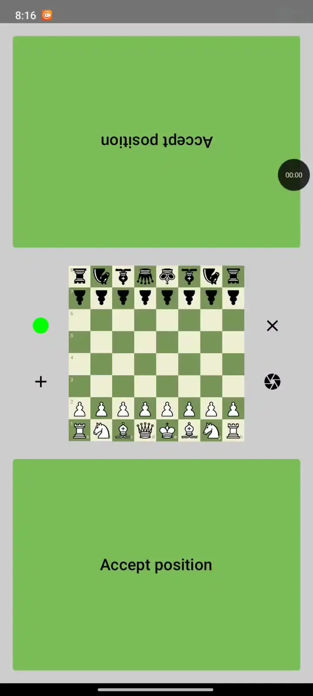

# ChessLens - Chess Position Recognition System

## 📋 Overview

ChessLens is an intelligent chess position recognition system that combines computer vision and machine learning to automatically detect and identify chess pieces on a board using a smartphone camera. The system features comprehensive game tracking functionality that allows players to play complete chess games with move validation, position tracking, and automatic game export to Lichess. The system consists of two main components:

- **Android Application**: Captures video feed, tracks game progress, validates moves, and exports games to Lichess
- **Python Server**: Processes images using trained YOLO models to detect chess pieces and board positions in real-time


*Real-time chess piece recognition with YOLO models in action*

## 🏗️ Project Structure

```
Chess/
├── android/                          # Android application
│   ├── app/
│   │   ├── src/main/java/com/example/chesslens/
│   │   │   ├── MainActivity.kt       # Main activity with camera/board view switching
│   │   │   ├── ui/                   # UI components (CameraApp, BoardContent, ClockApp)
│   │   │   ├── viewmodel/            # MVVM architecture components
│   │   │   ├── game/                 # Chess game logic (move validation, position tracking)
│   │   │   ├── serialization/        # PGN export and Lichess integration
│   │   │   ├── websocket/            # WebSocket client for server communication
│   │   │   └── utils/                # Image analysis and chess utilities
│   │   │   └── config/               # Websocket configuration
│   │   │   └── chessMovements/       # Chess pieces movement logic
│   │   │   └── enums/                # Usefull enums
│   │   └── build.gradle.kts
│   └── build.gradle.kts
├── chesslens_server/                 # Python backend server
│   ├── server.py                     # FastAPI WebSocket server
│   ├── src/chess_rec/
│   │   └── chess_position_recognizer.py  # Core recognition logic
│   │   └── draw_helper.py            # Functions for better visualization
│   ├── models/                       # Trained YOLO models
│   │   ├── yolo_board_seg/          # Board segmentation model
│   │   └── yolo_chess_piece/        # Piece detection model
│   ├── datasets/                     # Training datasets
│   ├── scripts/                      # Data generation and training scripts
│   │   ├── dataset_maker.py          # Bootstrapping dataset generation
│   │   ├── dataset_shuffler.py       # Dataset shuffling utilities
│   │   ├── main.py                   # Main bootstrapping script
│   │   └── saved_position.py         # Position saving utilities
│   ├── train_yolo.ipynb             # YOLO model training notebook
│   └── pyproject.toml               # Python dependencies
└── README.md
```

## 🚀 How It Works

### 1. Image Capture & Processing
- Android app captures video frames using CameraX at 5 FPS (200ms intervals)
- Frames are sent to the Python server via WebSocket connection
- Server processes images using two YOLO models:
  - **Board Segmentation Model**: Detects and segments the chessboard
  - **Piece Detection Model**: Identifies individual chess pieces


*YOLO board segmentation model detecting chessboard boundaries*


*YOLO piece detection model identifying chess pieces*

### 2. Position Recognition
The `ChessPositionRecognizer` class performs the following steps:
1. **Board Detection**: Uses trained YOLO11n-seg model to detect chessboard boundaries
2. **Perspective Correction**: Transforms the board to a square 640x640 image
3. **Piece Detection**: Identifies all chess pieces using trained YOLO11n model
4. **Position Mapping**: Maps detected pieces to chess notation (e.g., "e4", "d5")

### 3. Game Tracking System
The Android application features a comprehensive chess game tracking system:

#### Move Detection & Validation
- **PositionManager**: Orchestrates game logic and move validation
- **MoveValidator**: Validates legal moves including castling, en passant, captures
- **GameStateManager**: Tracks current player turn and game end conditions
- **Move Confirmation**: Players manually accept detected moves for accuracy

#### Game Features
- **Real-time Position Updates**: Live board state visualization
- **Move History**: Complete game recording with move list
- **Game End Detection**: Automatic checkmate and stalemate detection
- **Visual Feedback**: Move highlighting on the board

<p align="center">
  
</p>
*Complete chess game tracking with move validation and player interaction*

#### Lichess Integration
- **PGN Export**: Automatic conversion of games to standard PGN format
- **Lichess Import**: Direct upload to Lichess.org via API
- **Game URLs**: Shareable links to played games
- **FEN Support**: Starting position recording for analysis

### 4. Real-time Display
- Recognized positions are sent back to the Android app
- App displays the current board state with piece positions
- Supports both portrait and landscape orientations
- Visual move highlighting and game status indicators

## 🤖 YOLO Model Development

### Model Architecture

The system uses two specialized YOLO models:

1. **Board Segmentation Model (YOLO11n-seg)**
   - Purpose: Detect and segment chessboard boundaries
   - Architecture: YOLO11n with segmentation head
   - Input: 640x640 images
   - Output: Binary mask of chessboard area

2. **Piece Detection Model (YOLO11n)**
   - Purpose: Detect and classify chess pieces
   - Architecture: YOLO11n standard detection
   - Classes: 12 classes (6 white pieces + 6 black pieces)
   - Input: 640x640 images
   - Output: Bounding boxes with piece classifications

### Training Process

#### 1. Board Segmentation Training

**Dataset**: Custom homemade dataset with 30+ chessboard images captured in home environment. Initially experimented with ChessReD dataset but performance was inferior for home conditions.

**Training**: Used YOLO11n-seg architecture with 100 epochs, 640x640 input size, batch size 16. The model was trained to detect and segment chessboard boundaries with binary mask output.

**Results**: Achieved exceptional performance with precision: 0.998, recall: 1.0, mAP50: 0.995, and inference speed of ~38ms on GTX 1660 SUPER. The model reliably detects chessboard boundaries even under varying lighting and perspective conditions.

#### 2. Piece Detection Training

**Initial Approach**: Started with public datasets (ChessReD, GitHub chess datasets, Roboflow) but achieved only moderate performance (mAP50: 0.646). The models struggled with accurate piece classification, especially for black pieces.

**Self-Training Breakthrough**: Implemented a bootstrapping method where I used the initial model to detect piece locations while generating ground truth from known board positions. Created a custom dataset with ~800 images across 10 different chess positions.

**Fine-tuning Process**: Conducted sequential fine-tuning on custom datasets, starting with `self_training_set_part1` followed by `self_training_set_part2`. Used lower learning rates (0.001) for fine-tuning to preserve learned features.

**Final Results**: Achieved exceptional performance with mAP50: 0.993 (49.7% improvement), precision: 0.983, recall: 0.984, and inference speed of ~35ms on GTX 1660 SUPER. The model now reliably detects and classifies both white and black pieces with near-perfect accuracy.

### Key Training Insights

1. **Domain Adaptation**: Public datasets performed poorly on home environment images
2. **Self-training**: Bootstrapping method significantly improved performance
3. **Sequential Fine-tuning**: Multiple rounds of fine-tuning on custom data
4. **Data Augmentation**: Standard YOLO augmentations (mosaic, flip, HSV)
5. **Hardware**: Training on NVIDIA GTX 1660 SUPER with CUDA

## 🛠️ Setup & Installation

### Prerequisites
- Python 3.11+
- Android Studio (for Android development)
- NVIDIA GPU with CUDA support (recommended for training)
- Docker (optional, for containerized deployment)

### Server Setup
```bash
cd chesslens_server
poetry install
# Start FastAPI server on port 8765
poetry run uvicorn server:app --host 0.0.0.0 --port 8765
```

### Docker Setup (Recommended)
```bash
cd chesslens_server
# Build Docker image with CUDA support
docker build -t chesslens-server .

# Run container with GPU support
docker run --gpus all -p 8765:8765 

```

### Android Setup
1. Open `android/` in Android Studio
2. Update server IP in `Config.kt` file
3. Sync Gradle dependencies
4. Build and run on device/emulator
5. Grant camera permissions when prompted

### Configuration
- Update `WEBSOCKET_URL` in `android/app/src/main/java/com/example/chesslens/config/Config.kt`
- Ensure server and Android device are on the same network
- Default server port: 8765

## 🔧 Technical Details

### Server Architecture
- **Framework**: FastAPI with WebSocket support
- **Computer Vision**: OpenCV for image processing
- **ML Framework**: Ultralytics YOLO
- **Async Processing**: Non-blocking image analysis
- **Performance**: ~35ms inference time per image

### Android Architecture
- **UI Framework**: Jetpack Compose with Material 3
- **Camera**: CameraX with image analysis (200ms intervals)
- **Architecture**: MVVM with ViewModel and StateFlow
- **Game Logic**: Comprehensive chess engine with move validation
- **Communication**: WebSocket client with automatic reconnection
- **Networking**: OkHttp3 with Lichess API integration

### Data Flow
```
Android Camera → ChessImageAnalyzer → WebSocket → Python Server → 
YOLO Models → Position Recognition → WebSocket → PositionManager → 
Move Validation → Game State → PGN Export → Lichess Integration
```

## 🎯 Use Cases

- **Chess Analysis**: Automatic position recording and game analysis
- **Training**: Position tracking for chess training apps with Lichess integration
- **Tournament**: Automated game recording and digital scorekeeping
- **Education**: Chess teaching tools with game replay capabilities
- **Online Play**: Convert over-the-board games to digital format
- **Game Archive**: Build personal game databases with automatic PGN generation


## 📝 License

This project is licensed under the MIT License.

## 👨‍💻 Author

**FloudMe77** - [marecik.dariusz@gmail.com](mailto:marecik.dariusz@gmail.com)

---

*This project demonstrates advanced computer vision techniques for real-time chess position recognition, combining state-of-the-art YOLO models with custom training methodologies.*
